# **FP1 \- Proposal for Critique**

## Idea Sketches

### *Idea 1 - Timeline Portfolio*

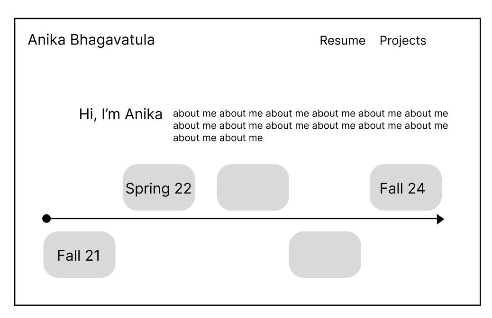

This project would convert my existing portfolio into my own code and design that
I have more flexibility with. I would implement this idea of a timeline visual 
where people can scroll to see how my research and project focuses have shifted
over my time as an undergrad. 

I would make the design interactive to users by including striking visuals, and 
allow for interaction with the timeline tool. Along with this, I would focus on 
making the design accessible by including contrast as well as larger, more legible
font. 

### *Idea 2 - Neuroscience Learning Tool*

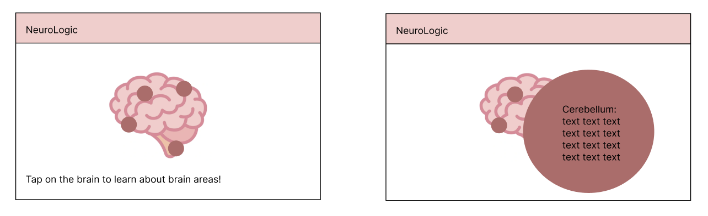

With this project, I would create an interactive platform to guide users in learning
more about the brain and specific conditions - such as neurodegenerative diseases,
addictions, and cognitive functions (the chemistry behind mental health). 
This tool could have an interactive brain map to learn about different areas
and have some concepts like "exploring the neural network" or "follow the synapse" 
interactions. 

I would need to use D3.js and other APIs to help visualize the brain map and other 
elements of the site. Accessibility would be highlighted with clear contrast and 
legibility. The goal here would be to communicate complex concepts in a way that 
is accessbile to a wide audience. 

### *Idea 3 - AR Interaction Tool*

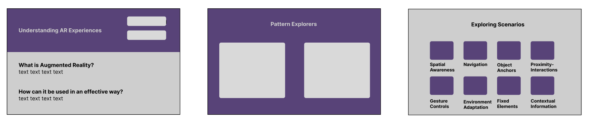

I spent this past summer doing research for AR environments, and was interested in 
creating a tool to cover the basic elements of AR designs and 3D spatial maps. 
With this project, I would create a tool that visualizes common design patterns 
in AR interfaces which could be interactive, allowing users to see examples of each pattern
and understand the best scenarios for each. Accessible interactive tools would 
be important to consider, given movement with keystrokes as well as the trackpad
and color contrast throughout the visuals.  It would be important to consider 
how the AR patterns would map to real world scenarios and I would also need to learn 
how to embed AR-appearing environments within the website. 

## Feedback Summary

For the first idea, I got feedback that creating my own portfolio into a coded, custom version gives the flexibility to create my timeline idea. It can represent the journey idea through a timeline. I would need to think more about how users could navigate the timeline - whether it would be long and use scrolling, or be more clicking. How long should this be on the main page etc. It also might be interesting to find other elements to use to make it more unique and different than my current portfolio. An important thing that I got as feedback, is that I already have a portfolio website, so this might not make as much sense to focus my time on. 

For the second idea, the neuroscience learning tool, I got more positive feedback. This has a lot more educational value and helps visualize and simplify complex topics. They mentioned that they need to have some interactive element to move around and look into maybe D3.js and APIs - this is something I would need to look into. There were some points brought up about simulating addiction through habitual tasks as well as addictive substances like sugar. To make this more visually interesting they mentioned using videos, animations, and other content to cater to diverse learning styles. 

The last idea I presented was the AR interaction tool, which focuses on learning AR applications and current use cases. The feedback I got was to convert this to more of an educational tool - where there could be embedded real world examples, and detailed applications - for example in user testing, providing alternative educational and learning resources for classrooms. This could also be accompanied by technical learning resources to understand more about technical HCI. Overall the feedback made me feel more hesitant about this idea - defining the scope and executing a useful product. 

## Feedback Digestion

My interpretation of the criticism led me to believe that the second idea was the most interesting and feasible. Firstly, when it comes to creating a portfolio, it would not be as beneficial considering I already have an existing portfolio and the timeline element could be a smaller project that would require slightly less time. For the last idea, I came to the conclusion that the scope was not as defined as the other two ideas, which makes it difficult to understand the APIs and how to embed certain features. I would need to experiment and practice with creating AR visuals and patterns - which I am not as familiar with yet. Because this also may not be as useful for users - less engaging and there may not be as much of a need as in learning about the brain and interactions that we experience everyday.  

Focusing on the second idea with neuroscience, I plan to create a 3D model of the brain using APIs or other javascript interaction libraries. This would be both useful as well as interesting to users. I could have an interactive brain map that has clickable regions of the brain - providing information about functions, associated conditions and research related to these areas. 
There could be learning modules or some type of simulation to show the onset of neurodegenerative diseases and the process of declining cognitive function - this could include interactive and clickable infographics or embedded videos. There could be interactive learning activities or games like ‘follow the synapse” to let signals travel in the brain and share scenarios related to conditions. Furthermore, after discussing with peers, I would emphasize accessibility features such as contrast, alt text for images or data visualizations, and keyboard navigation and support. 

---

# **FP2 \- Evaluation of the Final Project**

## Project Description

This project is an interactive tool that focuses on education of the brain and neuroscience principles. Users would be able to explore different brain areas, learn about the structures and cognitive functions that result. I might also implement a simulator to model concepts such as addiction or neurodegenerative diseases

## High-Fi Prototypes

### *Prototype 1*

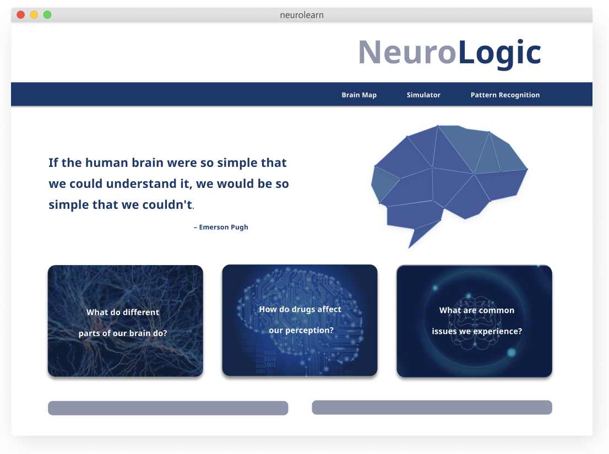

### *Prototype 2*

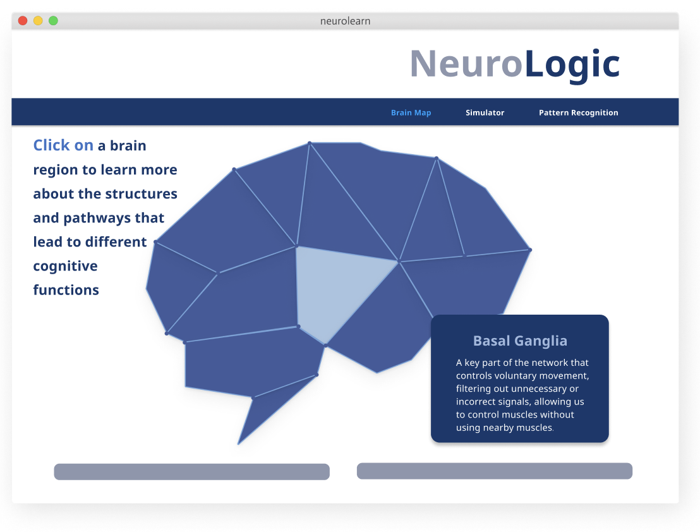

### *Prototype 3*

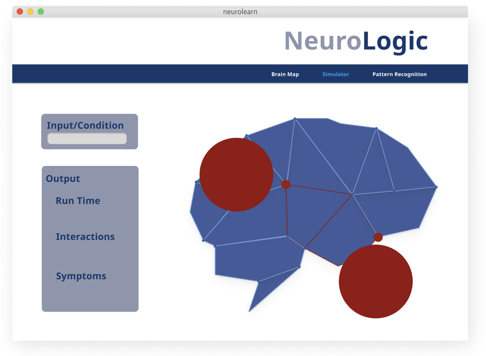

The user feedback that I had recieved was that the overall color scheme and layout was clear. For the first prototype with the main page, the layout was clear but the sizing of the menu was not as legible compared to the quote. For the second prototype, there could have been more information, and for the third prototype, the simulation inputs and how this interaction would work was not as clear. 

## Usability Test

I organized the usability test to have two parts: a functionality test as well as inquiring about the design. 
First, I outlined the main tasks that the user should complete using a think-aloud 
protocol. I wanted to hear about how they navigated the page and what elements they looked at 
to gather information. The tasks were to identify and list the functions possible on the main 
page. So the users described what was possible from this starting point. I then asked 
about locating information on different brain regions, whether the users could hover, and click 
correctly on the region. This would offer insights about website navigation and clarity. 
I also asked a question about how one could run a simulation. Users could navigate to a simulation page and attempt to initiate a simulation - so I could gauge how this might be self-explanatory and 
accessible the simulation is. 

The results of the test showed that there were several areas to address in the redesign. Users suggested that menu items could be made more readable and understandable to enhance accessibility. The brain map page was clear and easy to use, which ensured that the design  met user expectations. However, the simulation page would benefit from more introductory information to guide first-time users. While users found the color scheme's contrast effective, they suggested incorporating more detailed content to support information depth. This offered a clear direction to refine the platform and improve user experience.

Discuss the user feedback you got during the evaluation / usability test (\~300 words). Indicate which feedback you implemented, inspired new directions, or otherwise influenced your final design. 

## Updated Designs

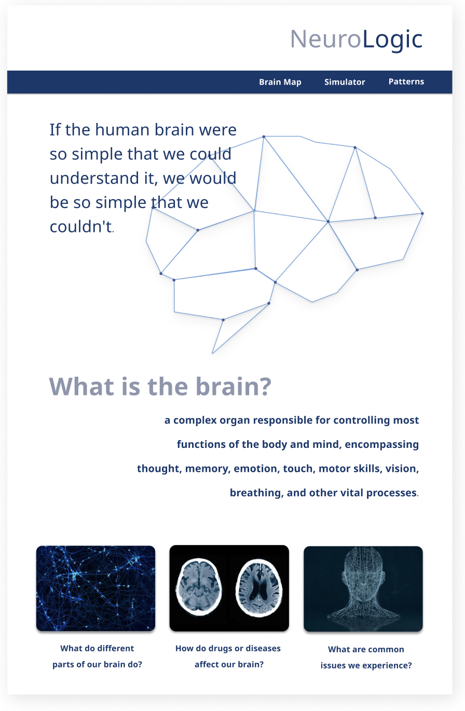
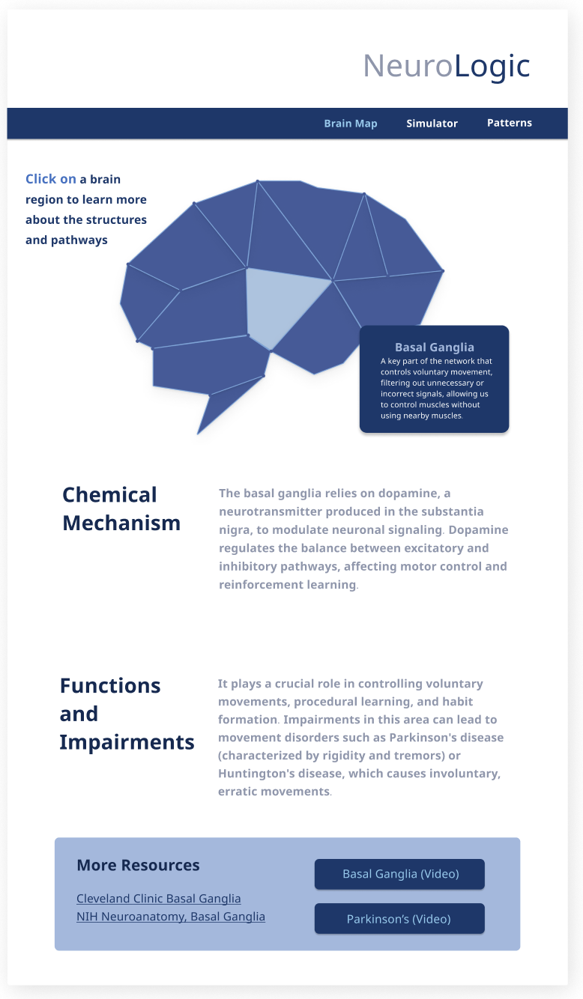

These updated high-fidelity designs addressed the following in the changes: a larger font in the menu for readability, moving the quote and changing the font size for the visual to be less busy. 
Adding more basic background information on the brain. Adding more in-depth information and analysis on the brain map page, and giving additional resources with embedded links. I would want the initial page to also have less static visuals (for example the brain can either move or show connections/synapses. 

## Feedback Summary

After presenting my usability test results as well as new designs our lab class, I received feedback focused on enhancing user interaction and making complex content more simple. I also got feedback on improving accessibility. One major suggestion was to streamline interactions and create the brain interface with D3.js. Since exploring brain regions is inherently complex, simplifying interactions by keeping visuals and controls intuitive and clearly explainedis essential. I can minimize unnecessary features and focusing more on on the essential interactive elements.

To improve accessibility, I got a recommendation that highlighting should not rely solely on color but also incorporate size variations. By adjusting both color and size, important information becomes more visible to users - especially those with color vision deficiences. I plan to apply this across various elements on the platform - this includes brain regions or data points and I hope to have an inclusive, clear site that is usable for all. 

An important suggestion was to make the landing page the simulator or brain map itself. This layout shift would give users immediate access to one of the main functionlities, allowing them to engage with simulations right from the start. Incorporating a dropdown menu for predefined conditions would allow users to select specific brain conditions - so that I could manually code these, simplifying the experience for any type of user.

In terms of visuals, the feedback emphasized using images of the brain to illustrate different slices and activity areas, which would help users understand the complex structure more intuitively. I may plan to integrate cross-sectional images with highlights showing active regions, possibly using D3.js to create interactive overlays. This would allow users to explore what different “lighting up” patterns mean in relation to brain function.

## Milestones

This site has many components so it might take breaking tasks up into weeks to make 
the process fragmented and easier to tackle. First, I would need to develop the basic UI for the 
three pages - the navigation menu, logo, textboxes, informational text, and images. 
I would then need to create a d3.js or three.js 3D brain that lights up in different areas and 
gives corresponding information about brain regions. Furthermore, I would need to understand how to create a simulation - a brain with correct representations. 

### *Implementation Plan*

- Week 9 Oct 28 \- Nov 1:
  - [X] FP1 due - Generate ideas 
  
- [ ] Week 10 Nov 4 \- Nov 8:   
  - [ ] Finalize idea and create template for all three html pages, css, and js file

- [ ] Week 11 Nov 11 \- Nov 15:  
  - [ ] Experiment with D3.js brain and figure out how to highlight these different brain areas

- [ ] Week 12 Nov 18 \- Nov 22:   
  - [ ] Create simulation environment and isolate the conditions to highlight 

- [ ] Week 13 Nov 25 \- Nov 29:  
  - [ ] Test with users to understand what changes should be made 
  - [ ] Make changes and update each of the pages to match the incentive

  - [ ] Thanksgiving  
- [ ] Week 14 Dec 2 \- Dec 6:  
  - [ ] FP4 due 

### *Libraries and Other Components*

I plan to use D3.js or three.js to create some type of interactable brain structure 
that users could play with. I would also try and use this for the simulation part as well. 

## Generative AI Use Plan

I plan to use Generative AI tools to create a style guide - it might give ideas on a color palette to follow, general shapes that would be applicable, and icons to consider and upload. 

I would also aim to generate a framework when using more complex tools like d3.js to create the brain map. This is something that I am not familiar with, so I might need a little bit more guidance on this. 
It can help me integrate the d3.js into the main html to visualize the brain. 

### *Tool Use*

* ChatGPT  
  * I will use it for generating ideas on how to structure code for the brain map and simulation because it can help me consider methods that I am not currently familiar with (including using the framwork d3.js)
  * I will not use it for writing code explicitly because it might not be able to help me with understand the meaning of what I am doing clearly.
* Dall-e
    * I will use it for understanding iconography and visuals that I can best use because it can help me identify good ways to convey information in a creative manner
    * I will not use it for creating the brain model because it might not be able to help me with interactivity of the site the way that it is intended to.      

### *Responsible Use*

How would you use Generative AI responsibly? 
- I would ensure that I do not just take the information given by AI in my solutions, and use it as a guide for implementing new ideas/code inspiration for the more complex development (especially with simulations and brainmaps in a 3D js library).

---

# **FP4 \- Final Project Writeup**

## Part 1: Web Description

The website, NeuroLogic is a tool for users to understand neuroscience and aspects of the brain in a more interactive way. For those who are unfamiliar with how the brain works and how basic neuroscience principles are understood, this website can be a useful first resource into that space. The website aims to be styled as minimalistic, bold, and serious. 

The information on this website is a first look into neuroscience. There are simple but crucial questions asked about what the brain is, how we understand it, and why human behavior can be mapped back to the brain. The website shares information on regions of the brain, allowing users to explore a 3D brain and examine how different areas have different purposes and functions. NeuroLogic also gives insight on how external factors affect the brain and its neuronal connections. For example, users can visualize how different stimulants or conditions can affect brain activity through a simulation. There is also further information and resources to encourage more learning through different types of media, including complex research papers. 

NeuroLogic is engaging in that it presents a way to interact with the brain directly in a 3D space - with both learning about the brain areas as well as exploring changes in conditions, and subsequently seeing how neurons can beb activated and connected through synapses. There are also dynamic interactions throughout the website, where users can see movements - like typing effects or image rotation that matches their interactions with the site itself. 

The website is catered to high school/college students and adults that are curious about neuroscience, but are generally unfamiliar with the subject. They look for a more refined resource that does not cater just to younger audiences, but can be more relatable to an older demographic. 

## Part 2: User Interaction

This page should be tested with a regular laptop size (1920 px) as well as
a tablet size (770 px). 

**Home Page**

The home page is the landing page for the website. It is more of an informational
page where users can scroll all the way down to see answers to overarching 
questions in neuroscience. There are moving pictures, parallax image backgrounds, and scroll movement animations for dynamic visuals. For users to interact, the navigation bar highlights "brain areas", "simulation", and "resources pages" where you can click into different website pages to navigate. 

**Brain Areas Page**

On this page, the top navigation bar can take you back to the home page or any other page. You can scroll down to view the 3D brain. In this brain container, you can click and drag the brain to view it from different angles. You can also zoom
in and out using the trackpad. There are red dots located in different 
regions of the brain that you can click to see the function, shown in a text box to the right. 

**Simulation Page**

On the Simulation Page, you can read about how particular stimulant substances (sleep and caffeine) as well as lack of sleep can affect neuronal activity. You can take a look at the basis of some of the parameters used here with the parameter detail boxes. For the brain simulation component of the website, there are three separate tabs for Sugar, Caffeine, and Sleep. You can toggle each of the paramaters with the sliders to see how dopamine sensitivity, amount of change in stimulant, environmental effects, and history of sensitivity can affect the brain's number of synapses. You should see a change in highlighted neurons as well as lines depicting connections between them. You can also see explanations of the simulation system under the Affected Pathways section below the interactive box. 

**Resources Page**

On this page, you can scroll down to see flippable cards that outline additional online neuroscience resources. You can hover over the cards to make them flip and click on the card to make it stay flipped to the back side. You can click on it again for it to flip to the front again. On the back, you can click on "View Resource" to go to the link to that particular source. 

For the Nature Journal Paper section, you can hover over a research item and click on the title to follow the link to the source. You can also click on the publication - which is a deep red color - to access the specific journal. 

## Part 3: External Tool

I used **three.js** as the external tool for this website. 
Compared to other libraries and tools, this option helped create a more interesting
visual for users - where they can interact and view elements in a 3d space. 
For a topic like neuroscience learning, it would help to visualize the brain in 
three dimensions, especially getting a sense for brain regions and neuronal connections. 
There were two applications of three.js, one was on the simulation page, 
and the other was the brain areas page. Both of these interactions are slightly
different, allowing the user to directly examine the brain to discover brain areas, 
or other the other hand they can manipulate parameters to view a simulation in 3d. 
It adds an additional level of depth for understanding the brain in space. 
Users would also easily be able to interact with these elements, offering a much
more engaging and exciting element of interaction. 

## Part 4: Design Iteration

There were many changes that I made from the original mockup and concept. 
The colors on the website were brighter - a white and blue theme - and as I was
changing the colors while coding, I realized that a more dramatic effect could be 
achieved with using black, white, grayscales, and pops of red. It also would allow
for clearer contrast - ensuring that color variations isn't the only distinction 
for text/buttons. I also made the pages more dynamic than I had originally thought. 
Although I wanted to go for a minimalistic design, I realized that there does have to 
be enough text to support the function and meaning of the site. I also wanted to add
visually interesting elements - like the typing effect for some titles throughout 
the site and a parallax effect for background images. The resource page cards were able 
to flip and there were small interactions like the gears shifting to be 
engaging and satisfying for users. Overall, as I worked on the implementation, 
I slowly added more interactions, and changed the theme a bit to invoke a more
'serious' and 'bold statement' type of ambience. 

## Part 5: Implementation Challenge

Some of the biggest challenges were the integration of the external 
brain visual and figuring out how to use terminal, get rid of errors and clean 
up outdated code. Editing that codebase was very difficult since it required
learning and familiarizing with how different parts rendered. 

I also found it difficult to generate the brain for the simulation page. 
This was one area where I utilized generative AI to help in the process, since
rendering an accurate visual was very challenging to do myself. 

## Part 6: Generative AI Use and Reflection

## Appendix

### Accessibility Evaluations with the WAVE Tool 

* Home Page
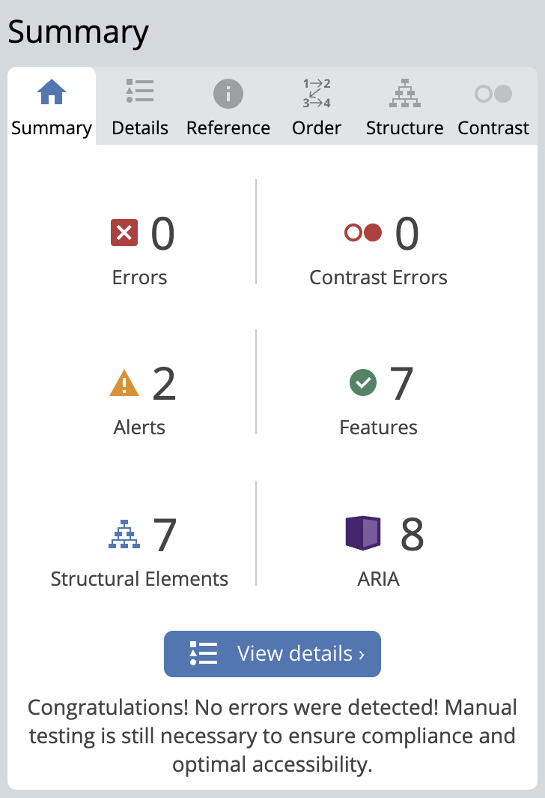
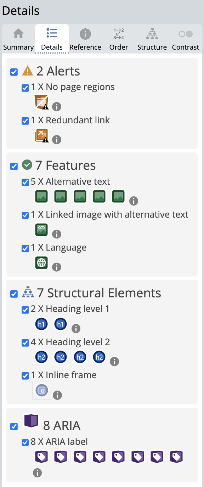

* Brain Areas Page
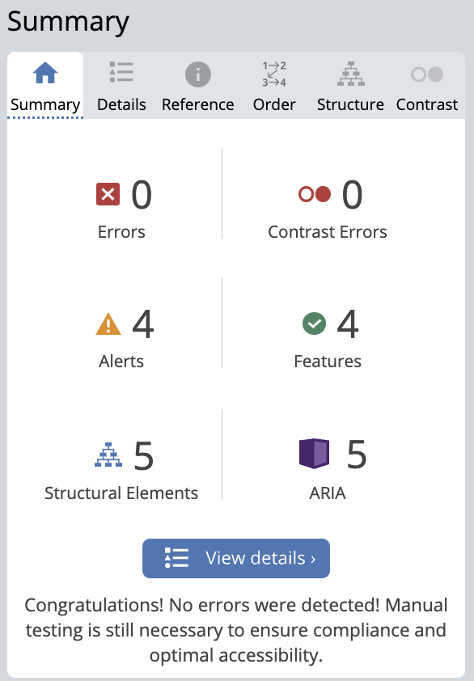
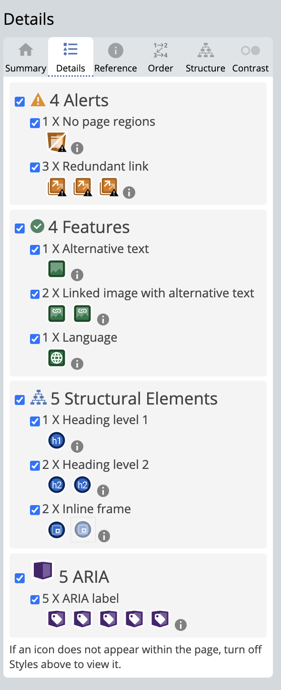

* Simulation Page
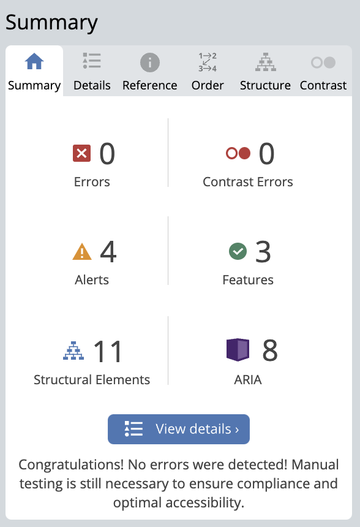
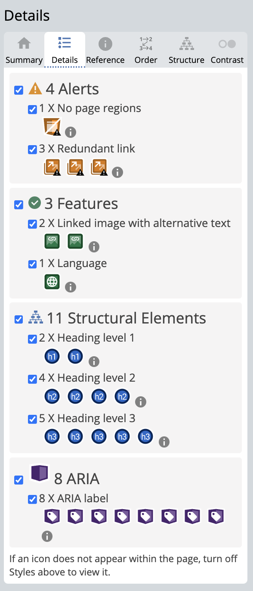

* Resources Page

